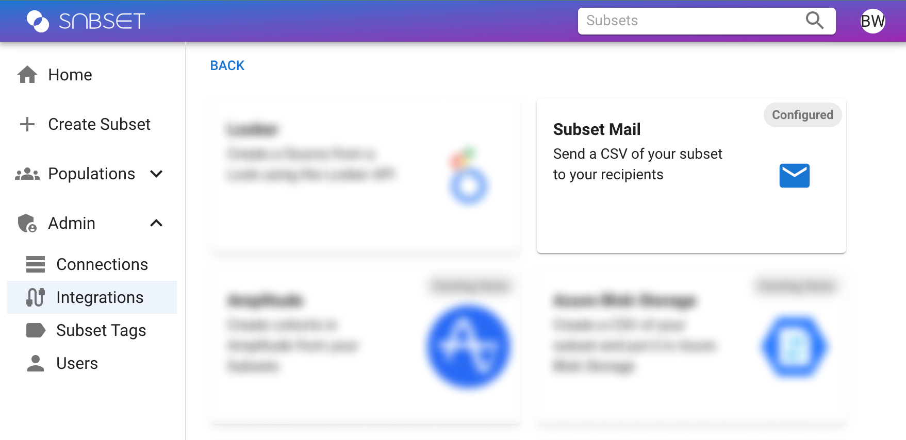
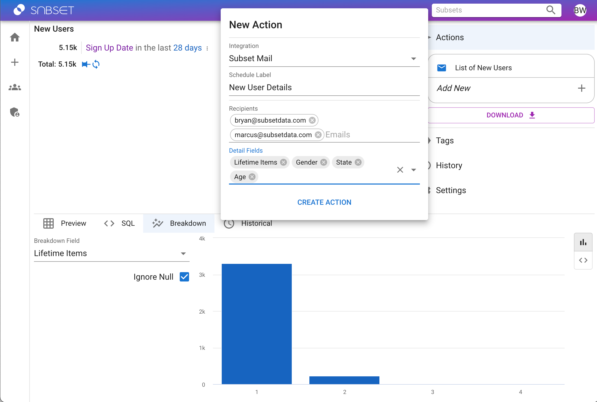

# Actions

## Overview
Subset allows users to send subset members and other metadata about the subset as attachments on a scheduled basis, in what we call Actions. Below is the list of current integrations in which Subset can send data on behalf of the end user.

## Subset Mail

Subset Mail integration is an email service for your Subsets and can be used in both hosted and self-hosted deployments. Thisintegration is turned on by default, but can be turned off in `Admin > Integrations`. 

### Actions

To use Subset Mail, create a new subset and open the Actions panel and click Add New. Enter in as many recipients you'd like and then configure which [Detail Fields](/docs/subset-building/detail-fields.md) you'd like to receive in the attachment. Subset Mail will then send you the CSV everyday at 11am ET.

:::info
Emails sent from Subset Mail are sent from donotreply@subsetdata.com
:::

:::caution
If you are self-hosting Subset, please make sure you are allowing egress to our mail server to use this integration. See [Required IP Addresses](/security/#subset-ip-addresses)
:::
